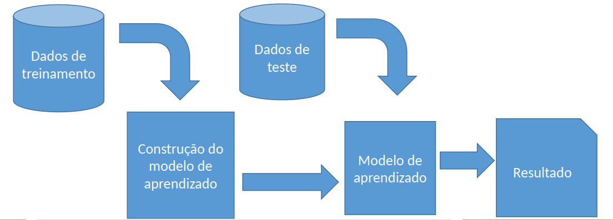

<!DOCTYPE html>

<html lang="en">
<head><meta charset="utf-8"/>
<meta content="width=device-width, initial-scale=1.0" name="viewport"/>
 
 
<!-- End of mermaid configuration --></head>
<body class="jp-Notebook" data-jp-theme-light="true" data-jp-theme-name="JupyterLab Light">
<main>

<html>  </html>

<h1 id=""><a class="anchor-link" href="#">¶</a></h1><html> <h1> -  Introdução à machine learning: Inteligência Artificial no Dia a Dia</h1> </html>
<h2 id="23-e-24/10/2023"><b>23 e 24/10/2023</b><a class="anchor-link" href="#23-e-24/10/2023">¶</a></h2><ul>
<li>CIC Fai 2023</li>
<li>professor Dr. Rafael Stoffalette João<html>
</html>
</li>
</ul>
<h3 id="Este-link-%C3%A9-do-material-(apostila)-que-seguimos-no-minicurso:">Este link é do material (apostila) que seguimos no minicurso:<a class="anchor-link" href="#Este-link-%C3%A9-do-material-(apostila)-que-seguimos-no-minicurso:">¶</a></h3>
<a href="https://htmlpreview.github.io/?https://raw.githubusercontent.com/rafaelstojoao/machinelearningcomexcel/main/CICFAI_analise_excel.html"> APOSTILA </a>

<h3 id="Este-link-cont%C3%A9m-todos-os-materiais-utilizados-(planilhas,-pdf-de-apoio,-etc...):">Este link contém todos os materiais utilizados (planilhas, pdf de apoio, etc...):<a class="anchor-link" href="#Este-link-cont%C3%A9m-todos-os-materiais-utilizados-(planilhas,-pdf-de-apoio,-etc...):">¶</a></h3>
<a href="https://github.com/rafaelstojoao/machinelearningcomexcel/">Pasta completa</a>

<h2 id="Objetivos">Objetivos<a class="anchor-link" href="#Objetivos">¶</a></h2><ul>
<li>É necessário saber programar? NÃO</li>
<li>É importante ter conhecimento básico sobre excel? TALVEZ</li>
<li>É essencial ter curiosidade? COM CERTEZA</li>
</ul>

O OBJETIVO deste encontro é despertar a curiosidade e vontade de "brincar" com os dados. Muitas vezes temos "achismos" sobre muitas coisas no nosso dia a dia. Com os dados não é diferente. Só que no mundo dos dados, o achismo ganha outro nome, o <b>INSIGHT</b>.

Um insight é uma pequena compreensão de um cenário, de forma intuitiva ou sistemática.

Saber como operar as ferramentas para confirmar nossos insights é essencial. Motiva a nossa curiosidade para buscar mais conhecimento sobre os nossos dados. Consequentemente, mais conhecimento sobre tudo que fazemos durante nossos dias.

<h2 id="Bibliografia-de-refer%C3%AAncia">Bibliografia de referência<a class="anchor-link" href="#Bibliografia-de-refer%C3%AAncia">¶</a></h2><html>   MITCHELL, Tom M. Machine Learning. Nova Iorque: McGraw-Hill, 1997.
 </html>
<html>   HASTIE, Trevor; TIBSHIRANI, Robert; FRIEDMAN, Jerome. The elements of statistical learning: data mining, inference, and prediction. 2. ed. Nova Iorque: Springer, 2009.   </html>
<html>   HAN, Jiawei; KAMBER, Micheline; PEI, Jian. Data Mining: Concepts and Techniques. 3. ed. Vermont: Elsevier, 2011 (The Morgan Kaufmann Series in Data Management Systems). </html>

   

<h2 id=""><a class="anchor-link" href="#">¶</a></h2><html> <h1>Microsoft Excel</h1></html>

O Excel é um editor de <b>planilhas digitais</b>. Mas o que de fato é uma planilha digital?

-- Nada mais é que uma forma organizada de armazenar dados/informação em formato de tabela.

   

<h2 id="Dados-x-informa%C3%A7%C3%A3o">Dados x informação<a class="anchor-link" href="#Dados-x-informa%C3%A7%C3%A3o">¶</a></h2><ul>
<li>Dado: qualquer valor armazenado.</li>
<li>Informação: compreensão útil (lógica) de um conjunto de dados.
 
 </li>
</ul>

Os dados por si só não possuem valor ou utilidade, Mas quando são organizados e processados de forma adequada, podem se tornar informações valiosas

<ul>
<li>Exemplo 1:
 <html></html>
</li>
</ul>

Note que ao observar esse conjunto de dados, não dá para imaginar qual o contexto (semântica) por trás dos dados.
Traz a sensação de: Por quê alguém armazenaria isso? Uma coisa não tem <b>relação</b> com outra

 
 

<ul>
<li>Exemplo 2:
 <html></html>
</li>
</ul>

Já neste exemplo, é bem intuitivo, ao observar os dados, verificar que se trata de um conjunto de dados <b>sobre</b> pessoas.
É essa a semântica/contexto. Essa relação entre as colunas é que nos dá a lógica dos dados, ou seja, a <b>INFORMAÇÃO</b>.

 
 
 
 

Para pensar

<ul>
<li>Como aglomeramos dados? (fontes de dados)</li>
<li>Qual a frequência em que adquirimos dados?</li>
</ul>

    
O MS Excel é uma ferramnenta, das diversas, para lidar com dados. O conceito de planilhas deriva das tabelas

<html></html>    - A representação tabular está associada a um endereço:   indicamos o endereço de algum dado, pelo índice que indica a linha que esse valor ocorre, seguido do número da coluna.    Por exemplo, na imagem ao lado, o valor "celula" é o valor armazenado pela célula no <b>endereço</b> 3,3  (linha 3, coluna 3)

 
 
 

<h1 id="Conjunto-de-dados">Conjunto de dados<a class="anchor-link" href="#Conjunto-de-dados">¶</a></h1><ul>
<li>Em muitos casos, os dados acabam sendo armazenados de uma forma não tão bem estruturada.</li>
<li>O relacionamento das tabelas, por si só, não garante <b> QUALIDADE </b> dos dados.</li>
<li>Desta forma, se torna muito difícil analisar dados que não tem qualidade - as informações são distorcidas</li>
</ul>

 
 

<h2 id="ETL-(Extract-Transform-and-Load---Extra%C3%A7%C3%A3o,-Transforma%C3%A7%C3%A3o-e-Carga)">ETL (Extract Transform and Load - Extração, Transformação e Carga)<a class="anchor-link" href="#ETL-(Extract-Transform-and-Load---Extra%C3%A7%C3%A3o,-Transforma%C3%A7%C3%A3o-e-Carga)">¶</a></h2>
Trata-se de uma das etapas mais importantes de uma análise inteligente.
Estima-se que 60% de todo o esforço de uma análise é concentrado na preparação dos dados.

<ul>
<li>Extract: De onde os dados vem? Estão atualizados? Virão mais?</li>
<li>Transform: Os dados estão adequados? Existem <b>problemas</b> com os dados?</li>
<li>Load:  Para onde os dados irão? Qual objetivo desta análise?</li>
</ul>

 
 

Etapa na qual:

<ul>
<li>as características não importantes são descartadas – limpeza;</li>
<li>mais de uma base de dados é utilizada – integração;</li>
<li>valores que fogem muito da normalidade são excluídos – detecção de outliers;</li>
<li>ruídos são filtrados;
 
 
 </li>
</ul>
<h2 id="Tipos-comuns-de-dados:">Tipos comuns de dados:<a class="anchor-link" href="#Tipos-comuns-de-dados:">¶</a></h2><pre><code>- Variáveis qualitativas - escalas nominais ou ordinais.
- Variáveis quantitativas - escalas intervalares e proporcionais.
- Variáveis categóricas/dicotômicas - sexo: M,F
- Variáveis binárias - 0 (ausência) ou 1 (presença).
- Variáveis discretas - idade
- Variáveis contínuas - distância.</code></pre>

 
 

<h2 id="Problemas-comuns-aos-dados:">Problemas comuns aos dados:<a class="anchor-link" href="#Problemas-comuns-aos-dados:">¶</a></h2>
Algumas situações são mais frequêntes que outras.

<html> Vamos ver um base de dados de exemplo. Faça o download da base, clicando <a href="https://github.com/rafaelstojoao/machinelearningcomexcel/raw/main/ds_ruidosa.xlsx" target="_blank">AQUI</a></html>

 
 
 

 
 

<ul>
<li><b>Dados Faltantes</b></li>
</ul>

Em muitas situações, a priorização de alguns valores, gera a despriorização de outros. Mas isso pode refletir em uma base de dados com os chamados "dados faltantes".
É importante a conscientização de que, uma vez que os dados são definidos como importantes, eles devem ser sempre priorizados à mesma medida. Isso pois num futuro, pode-se querer ter uma visão diferente da necessidade atual e os dados faltantes vão <b>enviezar</b> sua análise.

 
 
 

Veja a imagem abaixo. Observe que, por alguma razão alguns valores não estão presentes na tabela. Isso impossibilita uma análise dia a dia, por exemplo sobre as condições climáticas das cidades mapeadas. Nem todo dia pode ser considerado. [ou não - veremos como superar isso].

<html></html>

 
 
 
 
 
 

<ul>
<li><b>Ruídos</b></li>
</ul>

Da mesma maneira, os ruídos, agem nos conjuntos de dados. Note, pore exemplo, na tabela abaixo, que (provavelmente) alguns erros no sensor fazem com que a palavra "error" apareça em meio aos números.

<html></html>

É intuitivo que não dá para tratar textos e números da mesma maneira.
 
 
 
 
 

Para <b> IDENTIFICAR </b> estas ocorrências, basta um filtro simples no Excel.
Selecione a primeira linha de dados (cabeçalho) e busque pela opção <b>Ordenar e Filtrar</b>. Selecione a opção <b> Filtrar </b>, conforme a imagem abaixo nos mostra:
 

<html></html>

 
 
 
 

Ao clicar nas "setas" que aparecem no cabeçalho, agora, você pode ordenar os dados (de forma crescente ou decrescente) e verificar ao final da coluna que os dados problemáticos aparecem todos reunidos lá.

<html></html>

 
 
 
 
 
 
 

Para ambos os casos (ruído e ausência de dados), existem diversas abordagens para a correção.  Podemos:

<ul>
<li>Simplesmente remover as linhas problemáticas</li>
<li>Utilizar o conceito de média para preencher o valor faltante/ruidoso - =AVERAGE(:)  / =MEDIA(:)</li>
<li>Utilizar o conceito de mediana para preencher o valor faltante/ruidoso (mais recomendado) - = MED(:) /</li>
<li>Utilizar o conceito de moda para preencher o valor faltante/ruidoso - = MODA.SIMPLES(:) /=MODE.SNGL(:)</li>
</ul>

 
 
 
 

<section style="font-color:#6a6a6a">

<strong>Média</strong>, <strong>mediana</strong> e <strong>moda</strong> são diferentes medidas de centro em um conjunto de dados numéricos. Cada uma delas busca resumir um conjunto de dados com um único número para representar um dado "típico" desse conjunto.

<pre><code>- Média: o número "médio"; é encontrado somando-se todos os dados e dividindo pelo número de dados.</code></pre>

Exemplo: a média de
[4],
[1] e
[7] é
[(4+1+7)/3 = 12/3 = 4].
 
 

<pre><code>- Mediana: o número do centro; é encontrado ordenando-se todos os dados e escolhendo o que está no centro (ou, se houver dois números no centro, calculando-se a média desses dois números).</code></pre>

Exemplo: a mediana de
[4],
[1] e
[7] é
[4] porque, quando os números são colocados em ordem
[(1],
[4],
[7)], o número
[4] está no centro.

 

<pre><code>- Moda: o número mais frequente — ou seja, o número que aparece o maior número de vezes.</code></pre>

Exemplo: a moda de
[{4],
[2],
[4],
[3],
[2],
[2}] é
[2] porque ele aparece três vezes, ou seja, aparece mais que qualquer outro número.

</section>
 
 

 

<ul>
<li><b>Discrepâncias</b></li>
</ul>

Também chamadas de <b> Outliers</b> (fora da série)  é exatamente o que a tradução diz: um valor que foge à normalidade dos dados.

<html></html>
<pre><code>- É importante tratar os casos de *outliers* pois eles podem distorcer totalmete uma análise. 
- Veja o caso abaixo, onde a média de idades de pessoas em uma planilha é totalmente diferente quando  o *outlier* não é identificado</code></pre>
<html></html>

 
 
 
 
 

<strong>Para identificar</strong> os casos de discrepâncias de um conjunto de dados, temos várias estratégias.

<ul>
<li>
Uma delas é a mesma abordagem do filtro. Ao ordenar os valores as discrepâncias ficam nas extremidades;

</li>
<li>
Outra forma é por meio de gráficos.

</li>
<li>
Selecione a coluna que quer identificar a presença de <em>outliers</em>.

</li>
<li>
Na aba <b>Inserir</b>, busque a seção de <strong>gráficos</strong> e escolha a opção <strong>gráfico de dispersão</strong> (ou scatter plot).

</li>
</ul>
<html></html>

  
  

<ul>
<li><strong>Muitos valores numéricos</strong></li>
</ul>

Para lidar com valores numéricos contínuos, muitas vezes é exigido um esforço muito grande.
Uma estratégia muito comum quando esse tipo de situação é encontrada, é a chamada <strong>CATEGORIZAÇÃO</strong> de dados.

Categorizar é o ato de criar categorias para valores contínuos - transformar dados numéricos contínuos em valores categóricos.

Por exemplo, no caso da base de dados apresentada, é possível observar que a coluna Chuva apresenta altíssima variância. Ou seja, é muito difícil encontrar valores repetidos nesta coluna (coluna E).

Entretanto, para a análise que estamos supondo, não é preciso saber o valor com tantos detalhes. A intensão aqui é identificar quando tivemos chuvas fortes, ou fracas.

Se assumirmos que chuva forte é toda aquela precipitação acima da média para a região, uma fórmula simples do Excel pode nos trazer esse valor

 
=AVERAGE(E2:E200) ou =MEDIA(E2:E200)

 
 
 
E se a nossa intensão é identificar Se um valor é alto (com base na média dos valores), a fórmula abaixo poderia nos trazer essa visualização com muita clareza:

 

=IF(Ei&gt;AVERAGE(E0:EN);"Forte";"Fraca")  ou =SE(Ei&gt;MEDIA(E0:EN);"Forte";"Fraca")

 
Observe que não precisamos criar mais problemas ao trocar números por texto. Podemos utilizar o valor 1 e 0 para indicar quando a chuva é forte, ou fraca.

<html></html>

 
 
 
 

<ul>
<li><strong>Escalas diferentes</strong></li>
</ul>

Outra situação muito presente nas bases de dados é a divergência da escala dos valores.
Podemos estar lidando com uma tabela que tem na coluna valores que não ultrapassam o número 10 e em outra coluna, valores na casa do milhão.

Imagine criar um gráfico com escalas tão distintas; É muito difícil entender os dados e o comportamento presente quando as escalas estão tão distantes.

A recomendação para estes casos é a <strong>Normalização min-max</strong>

 
Esta técnica é usada para normalizar dados em uma escala específica, como valores entre 0 e 1.

A ideia é transformar os valores para que estejam na mesma escala, independentemente do seu valor original.

A fórmula para calcular a normalização min-max é:

<pre><code>-  x_norm = (x - x_min) / (x_max - x_min), </code></pre>

onde x é o valor original, x_min é o valor mínimo do conjunto de dados e x_max é o valor máximo.

<html></html>

 
 
 
 

<h1 id="Hora-da-A%C3%A7%C3%A3o">Hora da Ação<a class="anchor-link" href="#Hora-da-A%C3%A7%C3%A3o">¶</a></h1><h2 id="Realize-o-tratamento-adequado-na-base-de-dados-ruidosa-que-voc%C3%AA-baixou-(LINK)">Realize o tratamento adequado na base de dados ruidosa que você baixou (<a href="https://github.com/rafaelstojoao/machinelearningcomexcel/raw/main/ds_ruidosa.xlsx" target="_blank">LINK</a>)<a class="anchor-link" href="#Realize-o-tratamento-adequado-na-base-de-dados-ruidosa-que-voc%C3%AA-baixou-(LINK)">¶</a></h2>
Trata-se de uma base de dados que mapeia as condições climatológicas de algumas cidades da região e relaciona, também, valores investidos para comprar equipamentos, custear operações e manter o monitoramento constante.

Você verá na planilha, as colunas Data da coleta, valor de umidade, valor de temperatura, vento, precipitação de chuva em mm, qual o sensor que realizou a captura, em qual cidade foi feita a leitura e qual valor investido para aquele dia.

<h2 id="O-que-voc%C3%AA-consegue-observar-nos-dados?">O que você consegue observar nos dados?<a class="anchor-link" href="#O-que-voc%C3%AA-consegue-observar-nos-dados?">¶</a></h2>
 
 
 

<h2 id="O-que-%C3%A9-minera%C3%A7%C3%A3o-de-dados">O que é mineração de dados<a class="anchor-link" href="#O-que-%C3%A9-minera%C3%A7%C3%A3o-de-dados">¶</a></h2>
A I.A. foi, inicialmente projetada, para prever valores e situações.

A previsão só é possível pois algo é recorrente. – padrão

Portanto, podemos entender tudo isso como uma busca por <b>padrões</b> que ocorrem com frequência nos nossos dados.

O termo <b> MACHINE LEARNING</b> ganhou notoriedade em meados dos anos 90 com a busca pela Inteligência Artificial;

Para um sistema ser inteligente, deve aprender. Focar no processo de aprendizagem pode ser o diferencial do
algoritmo;
 
 
 
 

O processo de KDD (Knowledge Discovery in Data) envolve toda a machine learning

<html></html>

Um programa de computador aprende a partir de uma experiência E, com respeito a algumas classes de tarefas T, com performance P, se sua performance nas tarefas em T melhora com a experiência E.
 
 

Por exemplo:
T: Reconhecer letras escritas a mão, via imagens;
P: % de instâncias corretamente reconhecidas;
E: Base de dados de imagens de letras com o resultado esperado

Não existe um algoritmo para ensinar um computador aprender, como uma criança. Entretanto para diversas situações, existem estratégias que lidam com dados de forma a extrair o máximo de conhecimento possível.

 
 

 

Em 1959, Arthur Samuel definiu aprendizado de máquina como o "campo de estudo que dá aos computadores a habilidade de aprender sem serem explicitamente programados"

 
 

<ul>
<li>
Detecção de Fraudes - Bancos e operadoras de cartões, pioneiros na aprendizagem de máquina. Identificar possíveis transações fraudulentas e telefonar para o cliente confimar compras suspeitas.

</li>
<li>
Sistemas de recomendação - Há quanto tempo um humano não te filmes na Netflix?

</li>
<li>
Manuscrito - Qual a vantagem dos Correios tirarem fotos das nossas assinaturas, uma vez que imagens são mais pesadas (em MB)?

</li>
<li>
Autonomia - Uber e Tesla já têm carros rodando sozinhos nos EUA

</li>
</ul>

 
 
 
 

Para prever algo com eficiência é preciso aprender como o padrão se repete

<h2 id="Observando-as-tr%C3%AAs-imagens-abaixo,-voc%C3%AA-j%C3%A1-parou-para-pensar-em-quais-as-caracter%C3%ADsticas-%C3%A9-que-s%C3%A3o-determinantes-para-classificar-um-animal-como-PEIXE?">Observando as três imagens abaixo, você já parou para pensar em quais as características é que são determinantes para classificar um animal como PEIXE?<a class="anchor-link" href="#Observando-as-tr%C3%AAs-imagens-abaixo,-voc%C3%AA-j%C3%A1-parou-para-pensar-em-quais-as-caracter%C3%ADsticas-%C3%A9-que-s%C3%A3o-determinantes-para-classificar-um-animal-como-PEIXE?">¶</a></h2><html></html>
<html></html>
<html></html>

 
Agora que você já sabe que um peixe tem escamas, barbatana, cabeça triangular, etc etc...
 

 

 

 

<h3 id="aponte-essas-caracter%C3%ADsticas-nos-peixes-abaixo:">aponte essas características nos peixes abaixo:<a class="anchor-link" href="#aponte-essas-caracter%C3%ADsticas-nos-peixes-abaixo:">¶</a></h3><html></html>
<html></html>

 
 
 
 
 
Identificar características importantes é um desafio dos mais sérios no processode análise de dados - etapa conhecida como <b>"Seleção de
características"</b>

 
 

Uma das principais etapas do aprendizado Quais características são as mais importantes para definir a CLASSE que o algoritmo deve observar? tamanho, peso, comprimento, cor da carne, cor da cauda, ...

 
 
 
 
 
 
 
 
 

Após selecionar as melhores características para o contexto e treinar o algoritmo (nosso cérebro, no caso) é fácil afirmar que esse peixe é um:

<html></html>

 
 
 
 
 
 

<h2 id="Mas-e-nosso-exemplo-com-valores-num%C3%A9ricos?--O-que-fazer?">Mas e nosso exemplo com valores numéricos?  O que fazer?<a class="anchor-link" href="#Mas-e-nosso-exemplo-com-valores-num%C3%A9ricos?--O-que-fazer?">¶</a></h2>
 

A função =CORREL() pode ser utilizada para correlacionar as variáveis (colunas) dos nossos dados;

 
 
 

A correlação de <b>Pearson</b> é um teste estatístico que pode ser usado no cotidiano para compreender sobre a correlação linear entre duas variáveis quantitativas, atributo ou característica de determinado assunto.

 
 

O resultado é entendido como indicador à direção ou intensidade.

 

<b>Intensidade</b> trata do relacionamento entre as variáveis indicadas.

Já a <b>direção</b> é o tipo de correlação (positiva ou direta; negativa ou inversa).

 
 
 

Na prática, é um coeficiente “r” com valores que variam dos extremos entre -1 e +1, resultando na intensidade de uma relação linear entre dois conjuntos de dados.

<html></html>

 
 
 
 

<h3 id="Na-pr%C3%A1tica...">Na prática...<a class="anchor-link" href="#Na-pr%C3%A1tica...">¶</a></h3>
Observe a imagem abaixo, que descreve a aplicação de uma correlação de Pearson para produtos vendidos que tiveram desconto.
Por meio dela, é possível entender em quais produtos, o desconto aplicado teve mais efeito sobre a quantidade de vendas...

Indica quais produtos o público aguarda mais descontos.
Baixe a planilha (<a href="https://github.com/rafaelstojoao/machinelearningcomexcel/raw/main/dataset_pearson.xlsx" target="_blank">AQUI</a>)

<html></html>
<h3 id="E-para-o-nosso-caso...">E para o nosso caso...<a class="anchor-link" href="#E-para-o-nosso-caso...">¶</a></h3>

 

Vamos discutir um pouco sobre a fórmnula =FORECAST(X;B2:B8;C2:C8)

 
 
 
 
 
 
 
 
 

<h1 id="Tarefa-de-classifica%C3%A7%C3%A3o">Tarefa de classificação<a class="anchor-link" href="#Tarefa-de-classifica%C3%A7%C3%A3o">¶</a></h1>
Assim como outras estratégias de análise (Regressão / Agrupamento / Descoberta de padrões), observa as características (colunas) e os valores que elas assumem, para entender a semântica dos dados;

 
 
 

Tarefa da mineração de dados e aprendizado de máquina:
 
Associa dados a uma Classe por uma estratégia construída;
 
Novos dados são submetidos à mesma estratégia para afirmar a qual classe pertencem (classificar)

<html></html>

 
 
 
 
 
Para muitos contextos da nossa vida, é uma tarefa tão intuitiva que sequer nos atentamos ao que estamos fazendo....
 
 
 

... mas estamos classificando CONSTANTEMENTE

 
 

<pre><code>- altura: já é intuitivo separar exemplos em pessoas altas e baixas 
- por que não começar a separar os dados da mesma maneira?</code></pre>

 
 
 
 
 
 
 

<h2 id="Treinamento">Treinamento<a class="anchor-link" href="#Treinamento">¶</a></h2>
 

Etapa na qual observam-se os dados históricos (o que já temos) para entender tudo que já aconteceu e, principalmente, SE REPETE, para entender com mais facilidade o que pode ocorrer no futuro.

<pre><code>- Buscar padrões frequentes
- Buscar similaridade entre dados
- Buscar valores que são próximos
- ...</code></pre>

Geralmente a análise é feita após um treinamento supervisionado.

Etapa de aprendizagem &amp; Etapa de execução (teste)

<html></html>

 
 
 
 
 
 
 
 
 

<h2 id="An%C3%A1lise-for%C3%A7a-bruta-(intuitiva)">Análise força bruta (intuitiva)<a class="anchor-link" href="#An%C3%A1lise-for%C3%A7a-bruta-(intuitiva)">¶</a></h2>
Vamos observar, com cuidado, um exemplo clássico do aprendizado de máquina....

A base de dados é fictícia e descreve anotações de um jogador de tênis, sobre os dias passados que ele obsevou se o seu desempenho foi bom ou não.
Cada linha representa um dia observado e cada coluna, uma variável que foi mapeada.

 
 
Você conseguiria encontrar um jeito fácil de classificar um dia como "bom" ou "ruim" para uma partida de tênis?

Baixe a planilha (<a href="https://github.com/rafaelstojoao/machinelearningcomexcel/raw/main/tenis.xlsx" target="_blank">AQUI</a>)

<html></html>

=UNIQUE(dados!D2:dados!D999)

=COUNTIF(A2:A15;"Sol")

=FILTER(E2:E15;A2:A15="Nublado")

 
 
 
 
 
 
 

<h1 id="O-algoritmo-Naive-Bayes">O algoritmo Naive Bayes<a class="anchor-link" href="#O-algoritmo-Naive-Bayes">¶</a></h1>
Naive = ingênuo:
O nome se dá pelo fato que o algoritmo não supõe relação entre os atributos. - independência das variáveis

<ul>
<li>Simples;</li>
<li>Construção e execução Rápidas;</li>
<li>Necessita de poucos dados para seu treinamento;</li>
</ul>

Trata-se de uma estratégia simples e eficaz para dizer a <b> probabilidade </b> de um evento ocorrer, dado que eu conheço a chance de outro evento ocorrer.

<html></html>

Probabilístico
 P(A| B): Probabilidade de A ocorrer sendo que sei a probabilidade de B ocorrer
 P(B|A): Probabilidade de B ocorrer quando A ocorre
 P(A): Probabilidade de A ocorrer
 P(B): Probabilidade de B ocorrer

  
No nosso exemplo do jogo de tenis, imagine que o dia amanheceu ensolarado, qual a probabilidade de ser um bom dia para se jogar tenis?

Podemos resolver isso usando o método discutido acima de probabilidade posterior.

P (Sim |Sol) = P (Sol | Sim) * P (Sim) / P (Sol)

  P (Sol | Sim) = 3/9 = 0,33,
 P (Sol) = 5/14 = 0,36,
 P (Sim) = 9/14 = 0,64

 Porntanto, P (Sim | Sol) = 0,33 * 0,64 / 0,36 = 0,60,

  Ou seja, 60% de chance de ser um bom dia para jogo, visto que faz Sol

 
 
 
 
 

<h1 id="Vamos-para-uma-base-de-dados-mais-realista.">Vamos para uma base de dados mais realista.<a class="anchor-link" href="#Vamos-para-uma-base-de-dados-mais-realista.">¶</a></h1>
Neste (<a href="https://github.com/rafaelstojoao/machinelearningcomexcel/raw/main/dataset_vendas2.xlsx" target="_blank">Link</a>), uma base de dados de vendas é fornecida para que possamos por em prática um algoritmo de classificação em dados mais próximos da nossa realidade.

 
 
Este exemplo está completo na aba Naive Bayes da planilha baixada
 
 

<html></html>

 

Para isso, vamos seguir os seugintes passos:

<h2 id="Passo-1:">Passo 1:<a class="anchor-link" href="#Passo-1:">¶</a></h2><ul>
<li>
Criar uma nova aba (planilha)

</li>
<li>
Para cada coluna, vamos identificar todos os valores únicos

<ul>
<li>Por exemplo, para a coluna A (ClientID), utilize a fórmula =UNIQUE(dados!A2:dados!A999)</li>
</ul>

 
 
 
 
 

</li>
</ul>

<h2 id="Passo-2">Passo 2<a class="anchor-link" href="#Passo-2">¶</a></h2><ul>
<li>Agora, vamos incluir uma linha no topo da planilha (click com direito &gt;&gt; Inserir),</li>
<li>Forneca a seguinte fórmula  =COUNTA(B3:B1000)</li>
</ul>
<html></html>

 
 
 
 
 

<h2 id="Passo-3">Passo 3<a class="anchor-link" href="#Passo-3">¶</a></h2><ul>
<li>Na guia DADOS, selecione a opção Validação de dados e, em seguinda, escolha a opção "Lista" no critério de avaliação permitida</li>
</ul>
<html></html>

Indique o intervalo de células que contém os valores únicos que você identificou

<html></html>

 
 
 

 
 
 

<h2 id="Passo-4">Passo 4<a class="anchor-link" href="#Passo-4">¶</a></h2>
Por meio da fórmula:

<ul>
<li>=COUNTIF(dados!D2:dados!D1000; O5)</li>
</ul>

É possível encontrar a quantidade de ocorrências de cada item selecionado na sua lista suspensa

<html></html>

 
 
 
 

<h2 id="Passo-5">Passo 5<a class="anchor-link" href="#Passo-5">¶</a></h2>
A fórmula FILTER vai permitir que façamos uma consulta condicionada nos dados que temos disponíveis.

Por exemplo, podemos filtar os dados (da coluna A a M) com a condição que na coluna M (forma de pagamento) o valor seja igual ao valor na célula S5 (Boleto, por exemplo)

<ul>
<li>=FILTER(dados!A2:dados!M1000;(dados!M2:dados!M1000=S5))</li>
</ul>

 
 
 
 
 
 
A fórmula pode ser estendida para conter mais condições e deixar nossa filtragem ainda mais profunda

<ul>
<li>=FILTER(dados!A2:dados!M1000;(dados!M2:dados!M1000=S5)<em>(O5=dados!D2:dados!D1000)</em>(P5=dados!E2:dados!E1000))
 
 
 </li>
</ul>

E com auxílio de uma fórmula que conta a quantidade de ocorrências de uma palavra, buscar, por exemplo a quantidade de ocorrências da nossa filtragem
 

=COUNTA(O26:O1026)

<html></html>

<h2 id="Passo-6----Classificando-dados">Passo 6 -  Classificando dados<a class="anchor-link" href="#Passo-6----Classificando-dados">¶</a></h2>
Agora, por meio de uma razão simples, vamos identificar a proporção de registros da base de dados que nossa escolha do filto ocorre.

Por exemplo, a quantidade de ocorrências em que foi uma pessoa do sexo masculino que realizou a compra

<ul>
<li>=O7/$A$1</li>
</ul>
<html></html>

 
 
 
 
 

Supondo que uma pessoa entra na loja e pega um produto da categoria GAMES. Podemos ter uma previsibilidade de qual será a forma de pagamento que ele irá realizar, com base na nossa construção.

A pergunta que estamos fazendo é:

<ul>
<li>Qual a probabiliadde do pagamento ser em cartão de crédito, dado que o produto que a pessoa pegou é da categoria GAMES?</li>
</ul>

 
 
em outras palavras:
 
P(cartão | Games) = (P(Games | cartão) * P(cartão) ) / P(Games)

 
 
 
 
Vamos ajustar nosso filtro então, para capturar o montante correto de dados

=FILTER(dados!A2:dados!M1000;(dados!M2:dados!M1000=S5)*(Q5=dados!H2:dados!H1000))

<html></html>

=O25/S7 indica a taxa de registros do filtro (que construímos) sob o montante de pessoas que compra com cartão de crédito, sem filtragem

<h1 id="Desafio">Desafio<a class="anchor-link" href="#Desafio">¶</a></h1><h2 id="E-se....---A-nossa-d%C3%BAvida-fosse:">E se....   A nossa dúvida fosse:<a class="anchor-link" href="#E-se....---A-nossa-d%C3%BAvida-fosse:">¶</a></h2><h3 id="Qual-%C3%A9-a-probabiliade-de-uma-compra-ser-em-dinheiro,-dado-que-o-cliente-%C3%A9-uma-mulher-da-cidade-de-Adamantina?">Qual é a probabiliade de uma compra ser em dinheiro, dado que o cliente é uma mulher da cidade de Adamantina?<a class="anchor-link" href="#Qual-%C3%A9-a-probabiliade-de-uma-compra-ser-em-dinheiro,-dado-que-o-cliente-%C3%A9-uma-mulher-da-cidade-de-Adamantina?">¶</a></h3>

</main>
</body>
</html>